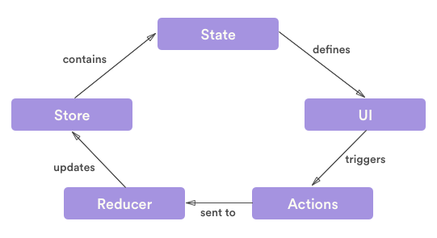

# HOUR OF CODE REACT

## Setup

- Instale o [NodeJs](https://nodejs.org/en/) caso não tenha
- No terminal rode este comando para instalar o create react app
  - `npm i create-react-app`
- Clone o projeto
- No terminal, dentro da pasta do projeto, rode este comando para instalar dependencias
  - `npm install`
  - Caso use o yarn execute : `yarn`
- Para rodar a aplicação rode este comando na pasta local onde você baixou o projeto
  - `npm start`
  - Caso use o yarn execute : `yarn start`

### Opcional - sugestões

- Editor de código [VSCode](https://code.visualstudio.com/)
- Snippets que ajudam no desenvolvimento
  - [JavaScript (ES6) code snippets](https://github.com/dtidigitalcrafters/react-do-zero/blob/master/README.md)
  - [Prettier - Code formatter](https://marketplace.visualstudio.com/items?itemName=esbenp.prettier-vscode)
  - [Reactjs code snippets](https://marketplace.visualstudio.com/items?itemName=xabikos.ReactSnippets)

## EP I - REVISÃO JS - ES6 - ES7 - ES8

### Features úteis - ver aplicação em `./src/App.js`

- var, const, let - scope
- criação/manipulação de objetos
- operações com arrays
- classes
- default parameters
- template literals
- multi-line strings
- arrow functions
- object literals
- destructuring
- promises
- async-await

## EP II - O QUE É REACT E COMO ELE FUNCIONA

- [Artigo](http://dtidigital.com.br/blog/considere-react-no-seu-projeto/)
- React é uma library para criar UI's
- Declarativa
  - mais previsível, mais fácil de debugar
- Baseado em componentes
  - não existe separação de tecnologias marcação (HTML) e lógica (JS)
    - em vez disso, separa-se **_concerns_** [SoC](https://en.wikipedia.org/wiki/Separation_of_concerns)
    - reduz acoplamento, aumenta coesão
  - o DOM é gerado via função(JS) pelo react
  - one-way-binding
    - mais fácil de controlar e debugar
  - o estado é controlado fora do DOM
  - o componente re-renderiza a UI sempre que algum estado muda
  - não quer dizer que todo DOM é atualizado. Somente as partes que de fato mudaram
  - isso é possível graças ao [virtual DOM object](https://www.codecademy.com/articles/react-virtual-dom)
    - uma representação virtual (em JS) do DOM real
  - o DOM real só é alterado nas partes que precisa ser alterado
    - caso seja identificado diferenças entre o DOM virtual antigo e o novo
    - caso contrário, o DOM real não é manipulado
    - isso faz com que a atualização seja muito menos custosa e muito mais rápida

### JSX e React elements

- JSX não é nem uma string nem é puramente HTML
- é como uma "notação" para criar _React Elements_. Análogo ao **xml**
- _React Elements_ não são DOM elements
- são apenas objetos simples que descrevem como o elemento deve ser
  ```javascript
  const element = <h1 className="greeting">Hello, world!</h1>;
  ```
- no final das contas o [Babel](https://babeljs.io) transpila o JSX criando o React Element via função
  ```javascript
  const element = React.createElement('h1', { className: 'greeting' }, 'Hello, world!');
  ```

### Como renderizar o elemento no DOM afinal?

- em algum lugar no HTML você tem
  ```javascript
  <div id="root" />
  ```
- e no JSX você cria seu elemento react, e fala para o React onde no HTML esse elemento deve ser renderizado
  ```javascript
  const element = <h1>Hello, world</h1>;
  ReactDOM.render(element, document.getElementById('root'));
  ```

## EP III - COMPONENTES

- orientação a componentes é uma forma de contornar duplicação de código
- então, se um ou vários elementos da sua UI são usados em diferentes locais com poucas ou nenhuma alteração visual e/ou de comportamento, você poderia considerar componentiza-los para reuso
- _"React is all about components"_
- componentes "são como" funções JS que recebem inputs (**props**) e renderizam elementos React
- há duas formas de criar componentes em react
- **function components** que são literalmente funções que recebem **props** como parametro e retornam **JSX** ou **null**
  ```javascript
  function Welcome(props) {
    return <h1>Hello, {props.name}</h1>;
  }
  ```
- e **class component** usando ES6 class. São classes que devem retornar um **JSX** ou **null** necessariamente excutando o método **render()**
  ```javascript
  class Welcome extends React.Component {
    render() {
      return <h1>Hello, {this.props.name}</h1>;
    }
  }
  ```
- usar **function components** ou **class components** implica em performance
- **function components** são mais performáticos
- **IMPORTANTE** antes da versão **16.6** os **function components** eram também conhecidos como **stateless components**, isso porque estes não controlavam seu próprio estado.
- os **class components** por sua vez eram também conhecidos como **stateful components** pois controlam o próprio estado e possuem _lifecycles_ (mais detalhes a seguir)
  . **NO ENTANTO** a partir da versão **16.6** do react, novas features possibilitam que **function components** controlem o seu próprio estado sem serem _classes_

### EP IV - COMPONENTES - Props

- o fluxo de data do React é **_top-down_**, ou seja o componente de mais alto nível passa o para componentes "filhos" via **Props**
- o componente pai chama o filho e passa as props necessárias
  ```javascript
  class MeuComponentPrincipal extends React.Component {
    render() {
      return (
        <div>
          <h1>Esta é uma aplicação React</h1>
          <Welcome name="Ramon" />
        </div>
      );
    }
  }
  ```
- o componente filho recebe as **props** e as usa
  ```javascript
  class Welcome extends React.Component {
    render() {
      return <h1>Meu nome é {this.props.name}</h1>;
    }
  }
  ```
- as **Props** recebidas por um componente são imutáveis
- um componente "pai" pode passar também, via **props**, referencias de funções implementadas no pai para serem chamadas nos filhos

## EP VI - Componentes - State/Lifecycle

### State

- O estado de um componente diz como este deve ser apresentado na tela
- Quando o estado do componente não depende ou não provém de um componente pai (**props**), o proprio componente controla seu estado. Isso pode ser chamado de estado local

  ```javascript
  class App extends Component {
    state = {
      comment: 'Comentário inicial'
    };
    render() {
      return (
        <div>
          <h1>Hello, world!</h1>
          <h2>My comment: {this.state.comment}.</h2>
        </div>
      );
    }
  }
  ```

- O estado de um componente deve ser alterado via chamada de função `setState({})`

  ```javascript
  // Errado
  this.state.comment = 'Hello';
  // Certo
  this.setState({ comment: 'Hello' });
  ```

### LifeCycle

- LifeCycle são alguns métodos que são executados durante o ciclo de criação ou atualização de um componente
- Esses métodos são executados pelo React, e só existe **lifecycle** em componentes do tipo **class components**
- Embora os **function components** não tenham **lifecycle**, novas features adicionadas ao React na versão **16.6**, possibilitam que **function components** se comportem exatamente como **class component** no que diz respeito a controle de estado e **lifecycle**.
- Essas novas features serão abordadas mais a frente..
- Existem **lifecycles** de criação e atualização do componente
- A atualização de um componente ocorre quando um componente pai passa props para o componente, ou quando o próprio componente atualiza seu estado via `setState()`
- Toda atualização irá invocar o **lifecycle** de atualização do componente novamente
- Entender o **lifecycle** e como a alteração de estado do componente interage com o **lifecycle** é extremamente importante e sua aplicação influencia diretamente na performance e usabilidade da aplicação
- Component **lifecycle** exemplo

  ```javascript
  class MeuComponente extends Component {
    state = {
      comment: 'Comentário inicial'
    };
    // o componentDidMount é um dos métodos do lifecycle de criação do componente
    // ele executa quando o componente acaba de renderizar
    componentDidMount() {
      setTimeout(() => {
        this.setState({
          comment: 'Altera o comentário 3 segundos depois que meu componente for montado'
        });
      }, 3000);
    }

    render() {
      return (
        <div>
          <h1>Hello, world!</h1>
          <h2>My comment: {this.state.comment}.</h2>
        </div>
      );
    }
  }
  ```

### Componentes - LifeCycle - React < 16.3


### Componentes - LifeCycle - React >= 16.3


## EP VI

### Navegação - React router

- Route
- Switch
- Link
- Navegação programática
- Navegação com parâmetros

### Navegação - Prática - Book Store


## EP VII

### Controle de estado da aplicação - React Redux

- controle de estado global da aplicação
- compartilhar estados entre componentes em qualquer nível
- store
  - state
    - guarda o estado da aplicação
  - reducers
    - funções que alteram o estado da aplicação
  - actions
    - ações que dizem como os reducers devem alterar o estado

### Controle de estado da aplicação - React Redux


### Controle de estado da aplicação - React Redux



## EP VIII - Alguns tópicos úteis

- [React fragment](https://reactjs.org/docs/fragments.html)
- [HOC](https://reactjs.org/docs/higher-order-components.html)
- [Render Props](https://reactjs.org/docs/render-props.html)
- [Composition](https://reactjs.org/docs/composition-vs-inheritance.html)

## EP IX - Aplicação conceitos no projeto BookStore

- Refatoração de componentes class transformando em functions
- Aplicação de hooks
- Aplicação de HOC
- Componentização, reuso e composição de componentes
- Melhorias de layout: uso do material ui

## EP X - Testes unitários

- Testes unitários de funções

  - [Jest](https://jestjs.io/)
  - Testes unitários de funções nos ajudam validar regras de negócio, tratamento de dados, etc
  - Exemplo: `.src/shoppingCart/tests/shoppingCartActions.test.js`

- Testes unitários de componentes
  - [Jest](https://jestjs.io/) + [Enzyme](https://airbnb.io/enzyme/)
  - Testes unitários de componentes nos ajudam validar renderizações de componentes, state/props, eventos, etc.
  - Exemplo: `.src/bookStore/tests/bookCard.test.js`

# REFERENCIAS

https://reactjs.org

https://developer.mozilla.org/pt-BR/docs/Web/JavaScript

https://www.lifewire.com/best-javascript-es6-features-4579821

https://medium.freecodecamp.org/ecmascript-2016-es7-features-86903c5cab70

https://medium.freecodecamp.org/es8-the-new-features-of-javascript-7506210a1a22
